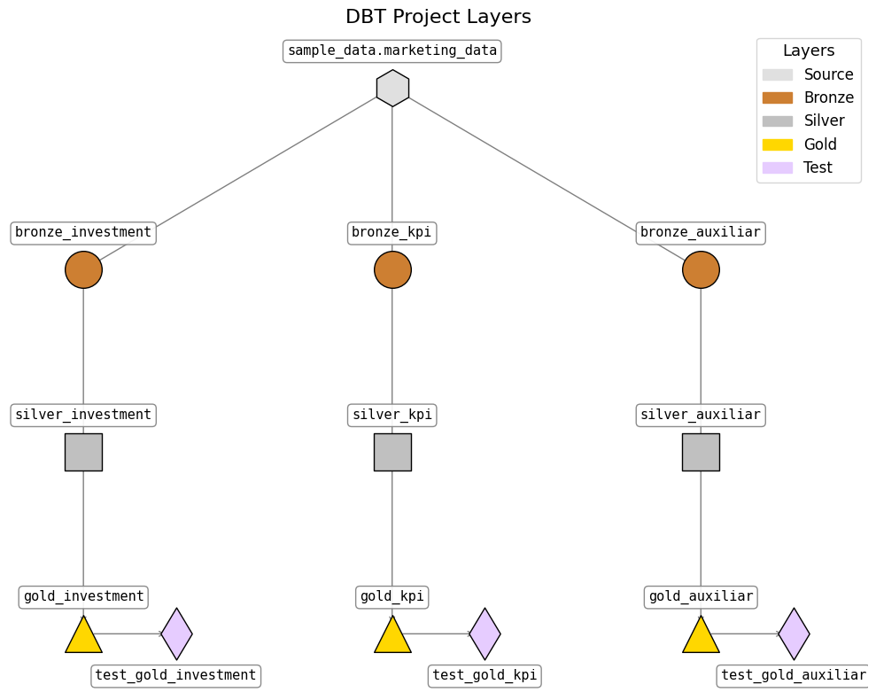

# dbt + BigQuery Data Pipeline Project

This project demonstrates the complete implementation of a dbt (Data Build Tool) pipeline using Google BigQuery and Google Colab. The pipeline follows a modular and well-structured approach, with a focus on reproducibility, version control, and validation at each stage. The workflow is broken into separate notebooks to reflect each step of the process clearly.

## Project Overview

The goal of this project is to create a dbt-based transformation layer for a marketing dataset hosted in BigQuery. The pipeline covers the full journey from raw CSV upload to cleaned, validated, and production-ready tables, organized in a layered architecture (bronze, silver, gold).

## How the Sample Data Was Created

Notebook: `marketing_data_generation.ipynb`

The sample dataset used in this project was programmatically generated using the Python. The script simulates two years of daily marketing data across multiple media channels with the following features:

- Trends: Gradual increase or decrease in media investments over time.
- Seasonality: Periodic patterns to reflect fluctuations in marketing activity throughout the year.
- Holiday Effects: Investment spikes during key holidays and brand-specific events.
- Random Outliers: Simulated budget bursts to mimic real-world behavior.
- Zero-Investment Days: Especially for non-digital channels, to replicate intermittent campaign activity.

Each media channel has its own independent time series logic, and the KPI (e.g., sales) is computed based on a combination of media inputs and noise.

This synthetic data allows safe experimentation with marketing models without the need for proprietary or confidential datasets.

## Pipeline Stages

### 1. Upload and Load to BigQuery
Notebook: `dbt_01_load_csv_to_bigquery.ipynb`  
- Authenticates with Google Cloud.
- Uploads a local CSV file.
- Creates a dataset and uploads the data into BigQuery.
- Verifies the success of the upload.

### 2. Configure and Build dbt Project
Notebook: `dbt_02_my_dbt_project.ipynb`  
- Mounts Google Drive for persistent storage.
- Installs and configures `dbt-bigquery`.
- Creates and initializes a dbt project.
- Defines macros for deduplication, null handling, interpolation, and validation.
- Separates logic into models: bronze (raw ingestion), silver (cleaned data), and gold (final validated tables).
- Defines tests using `dbt-utils`.

### 3. Visualize Model Dependencies
Notebook: `dbt_03_dependency_graph.ipynb`  
- Parses dbt models and tests to extract dependencies.
- Uses NetworkX and Matplotlib to visualize the model DAG (Directed Acyclic Graph) by layer and thematic group.

**Dependency Graph Example:**  


### 4. Data Validation and Testing
Notebook: `dbt_04_data_validation.ipynb`  
- Queries final gold tables directly from BigQuery.
- Performs additional manual validations in Python:
  - Checks for non-null values in key columns.
  - Ensures investment and sales values are greater than zero.
  - Confirms that `holiday` is binary (0 or 1).
- Joins all gold tables into a unified DataFrame for downstream analysis.

### 5. Security and Sensitive Data Check
Notebook: `dbt_05_sensitive_data_check.ipynb`  
- Scans all notebooks for potentially sensitive values using regular expressions.
- Flags:
  - API tokens.
  - Project IDs.
  - Variables with sensitive labels (e.g., `token`, `key`, `auth`).
- Reports detected matches by file and cell.

## Folder Structure

```
📂 dbt_project/
├── dbt_my_project/
│   ├── dbt_packages
│   ├── macros/
│   ├── models/
│       └── tests/
│   ├── target/
│   ├── dbt_project.yml
│   ├── profiles.yml
│   └── packages.yml
├── dbt_01_load_csv_to_bigquery.ipynb
├── dbt_02_my_dbt_project.ipynb
├── dbt_03_dependency_graph.ipynb
├── dbt_04_data_validation.ipynb
├── dbt_05_sensitive_data_check.ipynb
├── marketing_data_generation.ipynb
└── dbt_project_layers.png
```

## Key Features

- Google Colab-friendly and portable.
- Full dbt project integration with BigQuery.
- Automated graph generation of model dependencies.
- Manual and dbt-integrated data validations.
- Security inspection of source code to prevent leaks.

## Connect with Me

If you found this project useful or want to collaborate on analytics or dbt workflows, feel free to reach out via [LinkedIn](https://www.linkedin.com/in/nathanferig/).
